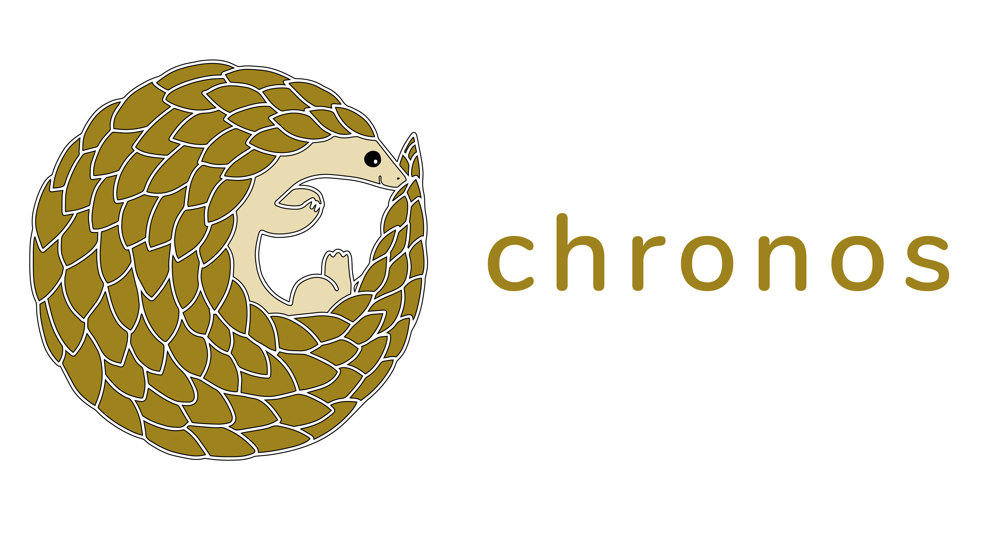

<p align="center">
  
</p>

[](https://github.com/open-source-labs/Chronos)


# Chronos

### A developer tool that monitors the health and web traffic of servers, microservices, and containers.

## NEW FEATURES FOR 4.0+ - Real-time Data and Docker Container Stats

- Improved user interface & experience
- Real-time data monitoring
- Decreased loading times
- Automated notifications(Slack, email)
- Easier to use configuration file
- Now works on Linux, Mac, and Windows
- Previous versions(less than 4.0) of Chronos are no longer supported


## Core Features
  <!-- * HTTP request tracing -->
- Docker container stats (e.g. ID, memory usage %, CPU usage %, running processes, etc.)
- Temperature, speed, latency, and memory tracking
- Process monitoring

## Quick start

### Install dependencies

```
npm install chronos-tracker
```

### Create a `chronos-config.js`

```js
// An example `chronos-config.js` file

const chronos = require('chronos-tracker');

chronos.use({
  microservice: 'payments',
  interval: 2000,
  dockerized: true,
  database: {
    type: 'MongoDB',
    URI: process.env.MONGO_URI,
  },
  notifications: [],
});
```

**More information on configuring Chronos and setting up notifications below**

### Initialize chronos

```js
const cmd = require('chronos-tracker');
require('./cmd-config'); // Bring in config file

cmd.propagate();
app.use('/', cmd.track());
```

**Download Chronos** to start monitoring your application data [here]()

<!-- # Installation

Chronos consists of a [Node](https://nodejs.org/en/) module available through the
[npm registry](https://www.npmjs.com/) and a lightweight [Electron](https://electronjs.org/) desktop application. -->

## Docker - Containerized Applications

IMPORTANT: Give your containers the same names you use for arguments for microservice names. Read more about it under the INSTALLATION section below.

IMPORTANT: In order to have container stats saved to your database along with other health info, when starting up the containers, bind volumes to this path:
`/var/run/docker.sock`

For example, you can type the following when starting up a container:
`docker run -v /var/run/docker.sock:/var/run/docker.sock [your-image-tag]`

If you're using docker-compose to start up multiple containers at once, you can add a `volumes` key for each of your services in the YAML file:

```
volumes:
  - "/var/run/docker.sock:/var/run/docker.sock"
```

\*Note: This module leverages the features of [systeminformation](https://systeminformation.io/).


## Configuration

The `microservice` property takes in a string. This should be the name of your server or microservice. For **Docker** containers, the same name of the microservice should reflect the name of the corresponding Docker container.

The `interval` property is optional and takes in an integer in milliseconds. This controls the monitoring frequency between data points. If this is omitted, Chronos will defualt to recording server health every 2000 ms or 2 seconds.

The `dockerized` property is optional and should be specified as `true` if the server is running inside of a Docker container. Otherwise, this should be `false`. If omitted, Chronos will assume this server is not running in a container.

The `database` property is required. T takes in the following:
- `type` which should be a string and only supports 'MongoDB' and 'PostgreSQL'.
- `URI` which should be a connection string the database you intend Chronos to write and record data regarding health, communication, and container infomation to. A `.env` is recommended.

- [6] isDockerized: Is this microservice running in a Docker container? Enter "yes" or "no". (Defaults to "no".)
  - IMPORTANT: When starting up the container, give it the same name that you used for the microservice, because the middleware finds the correct container ID of your container by matching the container name to the microservice name you input as 1st argument.
  - Don't forget to bind mount to Docker socket. See NEW FEATURE section above.

## Notifications

The `notifications` property is optional and allows developers to set up notifications when the monitored server responds to request with status codes >= 400. To set up notifications, set the value of the `notifications` property to an array of objects each with a `type` and `settings` property. 

Chronos only supports Slack and email notifications.

### Slack

Chronos uses the **Slack API** to send messages to a Slack channel and only requires the **webhook url**. Learn how to set up [Slack webhooks](https://api.slack.com/messaging/webhooks) for your team.

An example of configured **slack** settings:

```js
// ...
notifications: [
  {
    type: 'email',
    settings: {
      slackurl: process.env.WEBHOOK
    }
  }
]
// ...
```

### Email

Chronos provides the option to send emails. The properties that should be provided are the following
- `emails` - The recipient list (string) can be a single email address or multiple as comma seprated values. 
- `emailHost` - The smtp host (string) of your email server
- `emailPort` - The email port (integer) is either **465** or **587** depending on the sender email security settings. Learn more about email ports at the [nodemailer docs](https://nodemailer.com/smtp/)
- `user` - The email address (string) of the sender
- `password` - The password (string) of the sender email

_NOTE: Email notification settings may require alternative security settings to work_
 
An example of configured **email** settings:

```js
// ...
notifications: [
  {
    type: 'email',
    settings: {
      emails: 'foobar@email.com, bizbaz@email.edu',
      emailHost: 'smpt@gmail.com',
      emailPort: 465,
      user: process.env.SENDER_EMAIL,
      password: process.env.SENDER_PASSWORD
    }
  }
]
// ...
```

## Microservice Test Suite

Additionally, the repo includes a test suite of microservices utilizing the Chronos node module so that their communication, health, and container data can be logged. You can then visualize the data with the Electron app.

The microservices include individual Dockerfiles in their respective directories. A docker-compose.yml is in the root directory in case you'd like to deploy all services together.

Refer to the [README](https://github.com/oslabs-beta/Chronos/tree/docker/microservice) of that branch for more details.

#### Electron desktop application

After installing the node module in each microservice, download the Electron desktop application from the public [Chronos]() repo.

Inside the downloaded directory, install all dependencies using the `npm install` command followed by the `npm start` command to start the Electron desktop application.

## Contributing

Development of Chronos is open source on GitHub through the tech accelerator umbrella OS Labs, and we are grateful to the community for contributing bugfixes and improvements. Read below to learn how you can take part in improving Chronos.

- [Contributing](https://github.com/oslabs-beta/Chronos/CONTRIBUTING.md)

## License

Chronos is [MIT licensed.](https://github.com/oslabs-beta/Chronos/blob/master/LICENSE.md) 
