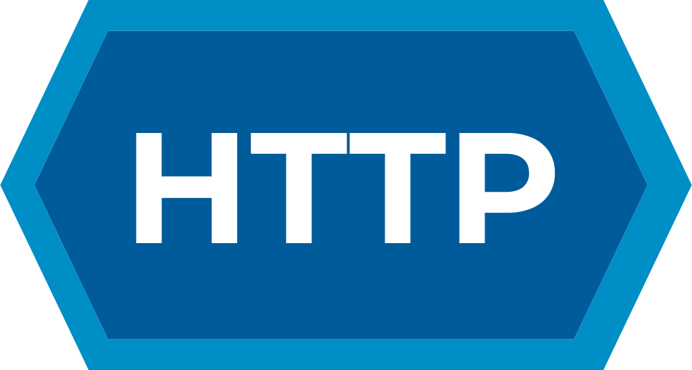
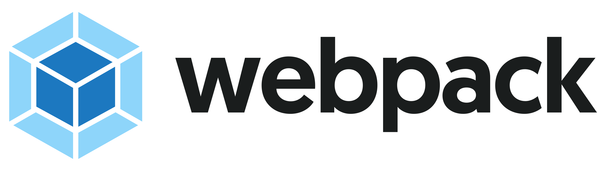

<a href="https://chronoslany.com/">
    
</a>

<br>


[](https://github.com/open-source-labs/Chronos)


#
# Chronos 

### Star us on GitHub — it helps!
Visit our splash page at [chronoslany.com](https://chronoslany.com/)

Chronos is a comprehensive developer tool that monitors the health and web traffic of servers, microservices, and containers. Use Chronos to see real-time data monitoring and receive automated notifications over Slack or email.

#

## What's New?
- Metric query tool so you can filter out specific metrics — now you only have to see what you want on the dashboard and reduce database bloat, keeping your database from being overwhelmed with data points that you don't actually need. 
- Kubernetes metrics monitoring via Prometheus.
- Additional metrics added, bringing Chronos up from only 12 to 100+ metrics that are currently available
- Option to filter by category and individual metric, and flip between services and categories with ease
- Apache Kafka monitoring capability, all you need to do is run Prometheus JMX exporter on the system your Chronos application is running on. A sample JMX config.yaml file is provided in the Chronos repository for a quick and easy setup, however you are free to configure however you like.
- Bug fixes and UI tweaks — Chronos is now a more seamless experience than ever.

## Features 
- Distributed tracing enabled across microservices applications
- Kubernetes monitoring via Prometheus server
- Compatible with </a>
- Supports <a href="#"></a> and </a> databases
- Displays real-time temperature, speed, latency, and memory statistics
- Display and compare multiple microservice metrics in a single graph
- Monitor an <a href="#"></a> cluster via the JMX Prometheus Exporter
- Monitor a Kubernetes cluster via a Prometheus monitoring server

#

## Demo
<br>
<br>
Signing Up
<br>
<br>
<a href="#"></a></a>
<br>
<br>
Using the Query Tool
<br>
<br>
<a href="#"></a></a>

#

## Installation
This is for the latest Chronos **version 8 release**.

**NOTE:** The Chronos tracker code is included in the *chronos_npm_package* folder for ease of development, but the published npm package can be downloaded by running `npm install @chronosmicro/tracker`

<br>

### Node Version
Make sure you're running version 16.17.1 of , to align with the  version used by  version 22. 

<br>

### WSL2 Environment
If you wish to launch the Electron Application in an WSL2 envirronment(Ubuntu) you may need the following commands for an Electron window to appear

- Install <a href='https://sourceforge.net/projects/vcxsrv/'>VcXsrv</a>

- Run the following command in the terminal

```
sudo apt install libgconf-2-4 libatk1.0-0 libatk-bridge2.0-0 libgdk-pixbuf2.0-0 libgtk-3-0 libgbm-dev libnss3-dev libxss-dev
```

- After running your VcXsrv instance, run the following command in the terminal
```
export DISPLAY="`sed -n 's/nameserver //p' /etc/resolv.conf`:0"
```

<br>

### Running the Chronos Desktop App in Development Mode
1. From the root directory, run `npm install`
2. Open a terminal and run `npm run dev:app` to start the Webpack development server
3. Open another terminal and run `npm run dev:electron` to start the Electron UI in development mode

### Packing the Chronos App into an Executable
1. From the root directory, run `npm run build`
2. Run `npm package`
3. Find the `chronos.app` executable inside the newly created `release-builds` folder in the root directory.

#

## Chronos Tracker Microservice Examples
We provide three working example microservice applications branch for you to test out Chronos:
- *examples/microservices*
- *examples/docker*
- *examples/kubernetes*

#### _Microservices_
In the `microservices` folder, we provide a sample microservice application that successfully utilizes Chronos to apply all the powerful, built-in features of our  monitoring tool. You can then visualize the data with the </a> app.

Refer to the [README](link) in the `microservices` folder for more details.

#### _Docker_
In the <a href="#"></a> folder within the `master` branch, we provide a sample _dockerized_ microservices application to test out Chronos and to apply distributed tracing across different containers for your testing convenience.

The `docker` folder includes individual <a href="#"></a> files in their respective directories. A docker-compose.yml is in the root directory in case you'd like to deploy all services together.

Refer to the [README](link) in the `docker` folder for more details.

<br>

#### _Kubernetes_
The `kubernetes` folder includes a React frontend and an Express server backend, and the Dockerfiles needed to containerize them for Kubernetes deployment. The *launch* folder includes the YAML files needed to configure the deployments, services, and configurations of the frontend, backend, and Prometheus server.


Refer to the [README](link) in the `kubernetes` folder for more details.

<br>

## Chronos Website  
The `chronosWebsite` branch holds the code for the splash page. Edit the website by checking out the branch, modifying the website, and then updating the AWS S3 bucket with the changes.

#
###### Return to [Top](#chronos)
<br>

## Technologies

- <a href="#"></a>
- <a href="#"></a>
- <a href="#"></a>
- <a href="#"></a>
- <a href="#"></a>
- <a href="#"></a>
- <a href="#"></a>
- <a href="#"></a>
- <a href="#"></a>
- <a href="#"></a> 
- <a href="#"></a>
- <a href="#"></a>
- <a href="#"></a>
- <a href="#"></a>
- <a href="#"></a>
- <a href="#"></a>
- <a href="#"></a>
- <a href="#"></a>
- <a href="#"></a>

#

## Contributing

Development of Chronos is open source on GitHub through the tech accelerator umbrella OS Labs, and we are grateful to the community for contributing bug fixes and improvements. Read below to learn how you can take part in improving Chronos.

- [Contributing](https://github.com/oslabs-beta/Chronos/blob/master/CONTRIBUTING.md)
#

## License

Chronos is [MIT licensed.](https://github.com/oslabs-beta/Chronos/blob/master/LICENSE.md)
#
###### Return to [Top](#chronos)
