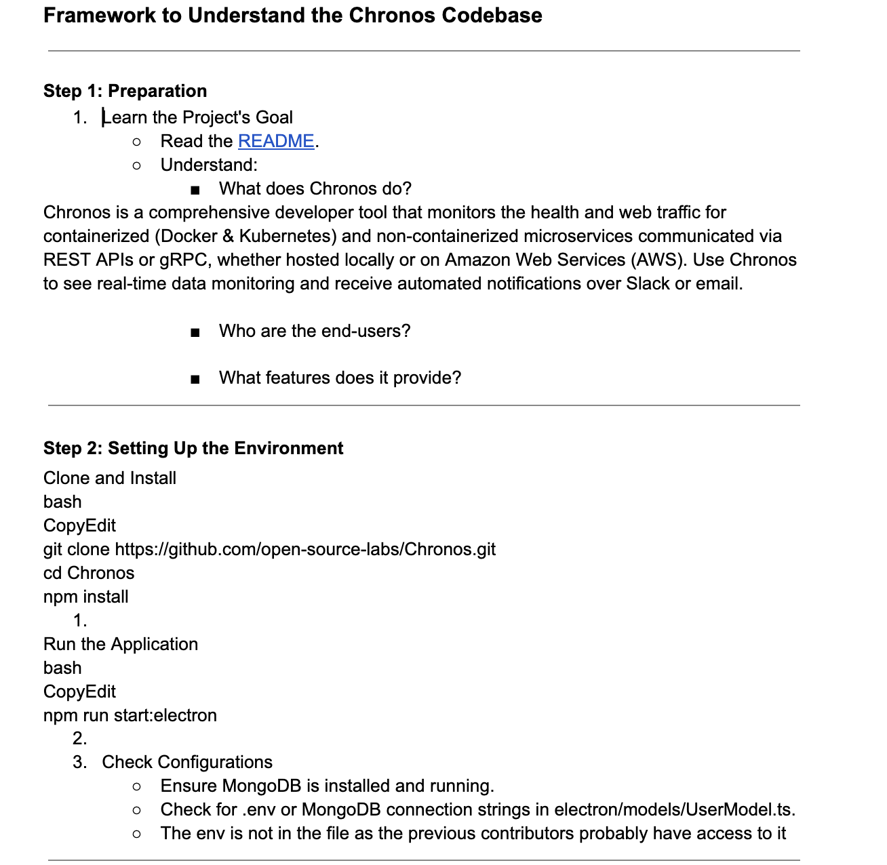
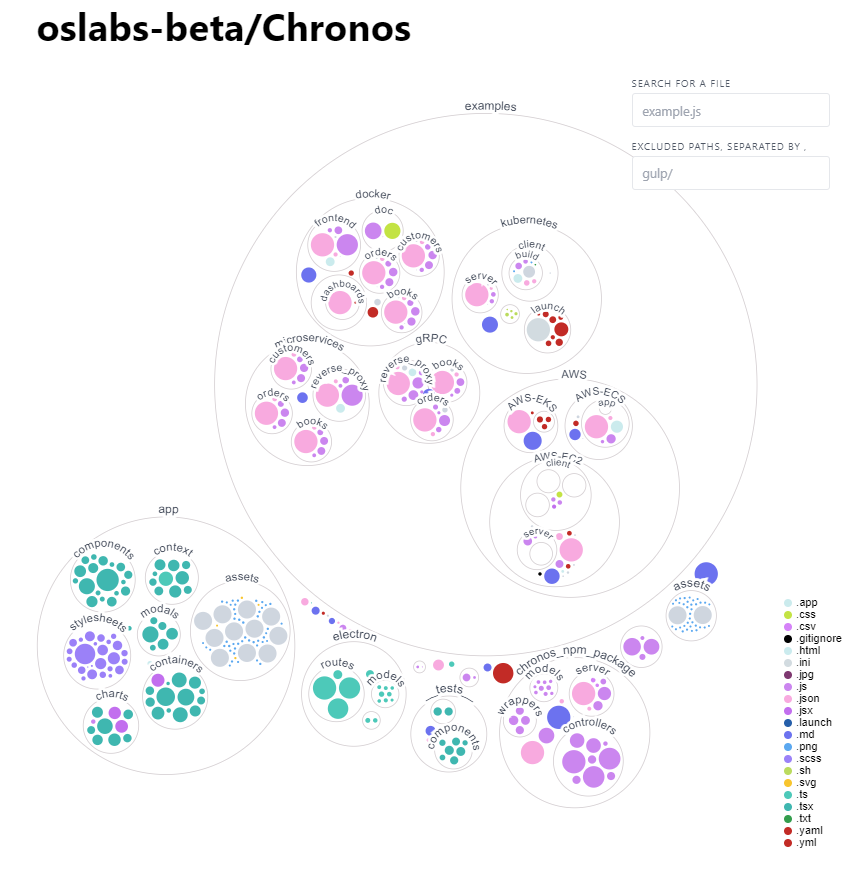

<a href="https://chronoslany.com/">
    
</a>
<div align="center">


[](https://github.com/open-source-labs/Chronos)


</div>

# Chronos

### ⭐️ Star us on GitHub! ⭐️

**Visit our website at [chronoslany.com](https://chronoslany.com/).**

Chronos is a comprehensive developer tool that monitors the health and web traffic for containerized (Docker & Kubernetes) and non-containerized microservices communicated via REST APIs or gRPC, whether hosted locally or on Amazon Web Services (AWS). Use Chronos to see real-time data monitoring and receive automated notifications over Slack or email.

## What's New?

### Chronos 15.0

<div>

Contributors:
[Arnold Pinkhasov](https://github.com/apinkhasov101),
[Ashley Bisram](https://github.com/ashleybisram),
[Fridchard Chery](https://github.com/Gitfrich),
[Peter Toussaint](https://github.com/Peter2oussaint)

</div>
Updates:
<li>Improved runtime by incorporating esbuild-loader, removing deprecated syntax/unused node modules, and other bundling optimizations.</li>
<li>Refactored SASS by updating deprecated syntax and import statements.</li>
<li>Grafana dashboard updates include deprecated syntax removal and a more intuitive layout, making it simpler for users to visualize key metrics in the newest version of Grafana.</li>
<li>TypeScript migration allows contributors and users to catch errors early and work with a more robust codebase, making the app more reliable.</li>
<li>Introduced ChroNotes, full documentation of our file structure and their purposes.</li>
<li>Refactored the UI of the app to give it a more intuitive appearance regarding where/how to initialize network monitoring.</li>


<a href='(https://ashleybisram.medium.com/a-new-chapter-for-chronos-introducing-version-15-0-12b83def342b)'>Version 15.0 Medium Article</a>

### **Iteration Log**
<details><summary>Chronos 14.0</summary>
    <ul>
    <div>


Contributors:
[Michael Tagg](https://github.com/mdtagg),
[Ted Pham](https://github.com/TedPham397),
[Sofia Sarhiri](https://github.com/sarhiri),
[Stephen Yang](https://github.com/stephenhyang)

</div>
Updates:
    <ul>
    <li>Implemented a new visualization button (example) to expedite data rendering processes.</li>
    <li>Refactored microservices example, switched over to community version of MongoDB for easier URI implementation.</li>
    <li>Modularized cluttered components into modular units to improve code readability and reusability.</li>
    <li>Optimized startup scripts to reduce application load time and streamline environment configuration.</li>
    <li>Upgraded Material-UI from version 4 to version 5, adapting to new API changes and improving UI responsiveness. </li>
    <li>Refactored portions of the electron app </li>
    <li>Refactored data parsing logic to reduce unnecessary rerenders and improve app performance</li>
    <li>Fixed data bottle necks in the local npm packages, data is now able to flow to microservices for data visualization</li>
    </ul>

<a href='https://medium.com/@m.sofiasarhiri/a-tale-as-old-as-time-for-the-modern-developer-chronos-v-14-f84733fd4f93'>Version 14.0 Medium Article</a>

</ul>
</details>

<details><summary>Chronos 13.0</summary>
    <ul>
    <div>


Contributors:
[Elsa Holmgren](https://github.com/ekh88),
[Mckenzie Morris](https://github.com/mckenzie-morris),
[Kelly Chandler](https://github.com/kchandler44),
[Sean Simpson](https://github.com/seantokuzo),
[Zhongyan Liang](https://github.com/ZhongyanLiang)

</div>
Updates:
    <ul>
    <li>Created new and improved microservices application with updated syntax to better demonstrate Chronos' capabilities</li>
    <li>Dockerized microservices application to demonstrate Chronos within a containerized environment</li>
    <li>Added visulization of Chronos' codebase to illustrate overall structure</li>
    <li>Simplified installation and startup instructions in the root directory README file</li>
    <li>Improved documentation in chronos_npm_package README file for easier on-boarding </li>
    </ul>

<a href='https://medium.com/@holmgren.e/crisis-averted-chronos-guards-against-development-disasters-8f3653f3c136'>Version 13.0 Medium Article</a>

</ul>
</details>

<details><summary>Chronos 12.0</summary>
    <ul>
    <div>

Contributors:
[Haoyu Liu](https://github.com/HaoyL666),
[Edwin Leong](https://github.com/edwinlny),
[Eisha Kaushal](https://github.com/eishakaushal),
[Tyler Coryell](https://github.com/Tcoryell)

</div>
Updates:
    <ul>
    <li>Grafana charting and visualizer</li>
    <li>Increase in Prometheus and cAdvisor integration span</li>
    <li>Increased testing coverage to include unit testing and Selenium-based, end-to-end testing</li>
    <li>Integrated CI/CD which automates GitHub Action to run testing suites in order and create a publishing action to NPM Registry</li>
    </ul>

<a href='https://medium.com/@coryelltyler/grafana-charting-improved-testing-and-ci-cd-with-chronos-12-0-6a1156cae456'>Version 12.0 Medium Article</a>

</ul>
</details>

<details><summary>Chronos 11.0</summary>
    <ul>
    <div>

Contributors:
[Brisa Zhu](https://github.com/beezoo10),
[Lucie Seidler](https://github.com/LucieSeidler),
[Justin Poirier](https://github.com/jcpoirier20),
[Jeffrey Na](https://github.com/jeffreyNa),
[Kelsi Webb](https://github.com/kelsicw)

</div>
Updates:
    <ul>
    <li>Interactive charting which can display and compare metrics in rendered graphs</li>
    <li>Increased user database security with user authorization to connect multiple</li>
    <li>services and databases and have instances persist without having to reconnect</li>
    <li>Improved documentation by adding ReadMes about how to initialize the app, how to use the given examples, and how to update config files</li>
    <li>Updated NPM Package to ‘increase reliability and ease of navigation</li>
    <li>Fixed bugs and improved test coverage</li>
    </ul>

<a href='https://medium.com/@zhu.brisa/interactive-charting-increases-user-engagement-with-chronos-11-0-61b6b8b7399b'>Version 11.0 Medium Article</a>

</ul>
</details>

<details><summary>Chronos 10.0</summary>
    <ul>
    <div>

Contributors:
[Brian Lim](https://github.com/brianlim89),
[Claire Tischuk](https://github.com/BoopdiBop),
[Lennon Stewart](https://github.com/noahoo7),
[Victor Ye](https://github.com/vctorye),

</div>
Updates:
    <ul>
    <li>Full user authentication integrating with a functional database which enables users to securely save their profile and data</li>
    <li>Updated microservices, gRPC, and Dockerized app examples</li>
    </ul>

<a href='https://medium.com/@br.lim89/taking-chronos-to-the-next-level-with-eks-monitoring-c9102a450b3c'>Version 10.0 Medium Article</a>

</ul>
</details>

<details><summary>Chronos 9.0</summary>
    <ul>
    <div>

Contributors:
[Brian Lim](https://github.com/brianlim89),
[Claire Tischuk](https://github.com/BoopdiBop),
[Lennon Stewart](https://github.com/eishakaushal),
[Victor Ye](https://github.com/vctorye)

</div>
Updates:
    <ul>
    <li>Added AWS - Users of Chronos are now able to monitor and visualize containers running in Amazon’s Elastic Kubernetes Service (EKS)~Medium</li>
    <li>Ability to monitor cost metrics through Opencast integration</li>
    </ul>

<a href='https://medium.com/@br.lim89/taking-chronos-to-the-next-level-with-eks-monitoring-c9102a450b3c'>Version 9.0 Medium Article</a>

</ul>
</details>

<details><summary>Chronos 8.0</summary>
    <ul>
    <div>

Contributors:
[Vince Ho](https://github.com/brianlim89),
[Matt Giant](https://github.com/BoopdiBop),
[Derek Lam](https://github.com/eishakaushal),
[Kit Loong Yee](https://github.com/vctorye)

</div>
Updates:
    <ul>
    <li>Rewrite microservice in a language with a higher level of support such as GO or Java</li>
    <li>Use packages such as OpenTelementry to record data and export said data to an additional application like Zipkin or Prometheus</li>
    <li>Purchase a license to one of the few monitoring tools that support gRPC and Node.js.</li>
    </ul>

<a href='https://derekquoc.medium.com/monitoring-node-js-grpc-microservices-with-chronos-deac9b227122'>Version 8.0 Medium Article</a>

</ul>
</details>

<details><summary>Chronos 7.0</summary>
    <ul>
    <div>

Contributors:
[Yang Song](https://github.com/curiousyang),
[Giovanni Floreslovo](https://github.com/gfloresl),
[James Edwards](https://github.com/Fredwards),
[Alex Kolb](https://github.com/alexkolb1)

</div>
Updates:
    <ul>
    <li>Ability to filter out specific metrics using a query tool</li>
    <li>Increased the number of metrics available from 12 to 100+</li>
    <li>Options to filter metrics by category</li>
    <li>Apache Kafka monitoring capabilities</li>
    <li>Bug fixes and UI improvements</li>
    </ul>

<a href='https://medium.com/@hannahsantoyo/introducing-chronos-7-a-complete-health-monitoring-tool-for-microservices-apache-kafka-clusters-f1ebad038074'>Version 7.0 Medium Article</a>

</ul>
</details>

### With Chronos 15.0

<a href="https://chronoslany.com/">
    
</a>

<br>

## Overview of the CodeBase

- In our ChroNotes, we have a full overview of all the files in the codebase, and their purpose.
<a href='https://docs.google.com/document/d/e/2PACX-1vTWIX6Is3uuvWX73ab5K521X7Ddr_fVN64F82bJ8l4VNF45cM9PbfDj2gVV9MVi_HhDrbNmZK51-dHP/pub'>Click here to view</a>!

- If you want to visualize the way the files in the app are connected, we suggest using this data visualizer. Below, it's showing the same repository, but instead of a directory structure, each file and folder as a circle: the circle’s color is the type of file, and the circle’s size represents the size of the file. See live demo
  <a href='https://mango-dune-07a8b7110.1.azurestaticapps.net/?repo=oslabs-beta%2FChronos'>here</a>.
  


## Features

- Cloud-Based Instances:
  - Option to choose between cloud hosted services and local services, giving Chronos the ability to monitor instances and clusters on AWS EC2, ECS, and EKS platforms </a>
- Local instances utilitizing `@chronosmicro/tracker` NPM package:
  - Enables distributed tracing enabled across microservices applications
  - Displays real-time temperature, speed, latency, and memory statistics for local services
  - Displays and compares multiple microservice metrics in a single graph
  - Allow Kubernetes and Docker monitoring via Prometheus server and Grafana visualization.
  - Compatible with </a>
  - Monitor an <a href="#"></a> cluster via the JMX Prometheus Exporter
  - Supports <a href="#"></a> and </a> databases

# Installation

This is for the latest Chronos **version 15.0 release**.

## NPM Package

In order to use Chronos within your own application, you must have the `@chronosmicro/tracker` dependency installed.

The `@chronosmicro/tracker` package tracks your application's calls and scrapes metrics from your system.

- **NOTE:** The Chronos tracker code is included in the _chronos_npm_package_ folder for ease of development, but the published NPM package can be downloaded by running `npm install @chronosmicro/tracker`.

For more details on the NPM package and instructions for how to use it, please view the [Chronos NPM Package README](./chronos_npm_package/README.md).

#

<!-- ### Node Version -->
<!-- v12 notes: Our team also had no issues - we ran Node 18 and Electron 22-->
<!-- v11 notes: Our team also had no issues - we ran Node 18.-->
<!-- v10 notes: Our team never reverted to version 16.17.1 and had no issues running Node 18 and Electron 22 together. Commenting this out for future iteration teams' reference. -->
<!-- Make sure you're running version 16.17.1 of , to align with the  version used by  version 22. -->
<!-- <br> -->

## Chronos Desktop Application

<!-- v13 notes : WSL environment does not work ----------------------------------->
<!-- ### WSL2 Environment

If you wish to launch the Electron Application in an WSL2 envirronment(Ubuntu) you may need the following commands for an Electron window to appear

- Install <a href='https://sourceforge.net/projects/vcxsrv/'>VcXsrv</a>

- Run the following command in the terminal

```
sudo apt install libgconf-2-4 libatk1.0-0 libatk-bridge2.0-0 libgdk-pixbuf2.0-0 libgtk-3-0 libgbm-dev libnss3-dev libxss-dev
```

- After running your VcXsrv instance, run the following command in the terminal

```
export DISPLAY="`sed -n 's/nameserver //p' /etc/resolv.conf`:0"
``` -->

### Running the Chronos desktop app in development mode (WSL Incompatible)

1. From the root directory, run `npm install`
2. Run `npm run start:electron` to start the electron app.
3. Run `npm audit fix` or `npm audit fix --force` if prompted
4. Refer to `Examples` sections below to spin up example applications.
   (Recommended):
   If you have mongo community edition running locally just run `npm run start:microservices` to start populating database with server data(more detail in Microservices Example section).

#

### Packing the Chronos desktop app into an executable

1. From the root directory, run `npm run build`
2. Run `npm run package`
3. Find the `chronos.app` executable inside the newly created `release-builds` folder in the root directory.

#

### Creating User Database

**NOTE: You must create your own user database for extended features**

1. Create a MongoDB database in which to store user information and insert it within a root .env file based on .env.example [.env.example](./.env.example) (_.env.example_) file.
   - This database will privately store user information.
2. Once this is set up, you can create new users, log in, and have your data persist between sessions.

#

# Examples

We provide eight example applications for you to test out both the Chronos NPM package and the Chronos desktop application:

- AWS
  - [EC2 README](./examples/AWS/AWS-EC2/README.md)
  - [ECS README](./examples/AWS/AWS-ECS/README.md)
  - [EKS README](./examples/AWS/AWS-EKS/README.md)
- Docker
  - [Docker README](./examples/docker/README.md)
- gRPC
  - [gRPC README](./examples/gRPC/README.md)
- Kubernetes
  - [Kubernetes README](./examples/kubernetes/README.md)
- Microservices
  - [Microservices README](./examples/microservices/README.md)

Additional documentation on how Chronos is used **in each example** can be found in the [Chronos NPM Package README](./chronos_npm_package/README.md).

#### _AWS_

The `AWS` folder includes 3 example applications with instructions on how to deploy them in AWS platforms. Note that using AWS services may cause charges.

- The ECS folder includes an web application ready to be containerized using Docker. The instruction shows how to deploy application to ECS using Docker CLI command, and it will be managed by Fargate services.
- The EC2 folder includes a React/Redux/SQL web application ready to be containerized using Docker. The instruction shows how to deploy application using AWS Beanstalk and connect application to RDS database. Beanstalk service will generate EC2 instance.
- The EKS folder includes a containerized note taking app that uses a Mongo database as its persistent volume. The instructions show how to deploy this application on EKS, how to monitor with Prometheus & Opencost, and how to use Grafana to grab visualizations.

Refer to the [EC2 README](./examples/AWS/AWS-EC2/README.md), [ECS README](./examples/AWS/AWS-ECS/README.md), and [EKS README](./examples/AWS/AWS-EKS/README.md) example in the _AWS_ folder for more details.

#

#### _Docker_

In the <a href="#"></a> folder within the `master` branch, we provide a sample _dockerized_ microservices application to test out Chronos and to apply distributed tracing across different containers for your testing convenience.

The `docker` folder includes individual <a href="#"></a> files in their respective directories. A docker-compose.yml is in the root directory in case you'd like to deploy all services together.

Refer to the [Docker README](./examples/docker/README.md) in the `docker` folder for more details.

#

#### _gRPC_

The `gRPC` folder includes an HTML frontend and an Express server backend, as well as proto files necessary to build package definitions and make gRPC calls. The _reverse_proxy_ folder contains the server that requires in the clients, which contain methods and services defined by proto files.

Refer to the [gRPC README](./examples/gRPC/README.md) in the `gRPC` folder for more details.

#

#### _Kubernetes_

The `kubernetes` folder includes a React frontend and an Express server backend, and the Dockerfiles needed to containerize them for Kubernetes deployment. The _launch_ folder includes the YAML files needed to configure the deployments, services, and configurations of the frontend, backend, Prometheus server, and Grafana.

Refer to the [Kubernetes README](./examples/kubernetes/README.md) in the `kubernetes` folder for more details.

#

#### _Microservices_

In the `microservices` folder, we provide a sample microservice application that successfully utilizes Chronos to apply all the powerful, built-in features of our monitoring tool. You can then visualize the data with the </a> app.

Refer to the [microservices README](./examples/microservices/README.md) in the `microservices` folder for more details.

#

# Testing

We've created testing suites for Chronos with React Testing, Jest, and Selenium for unit, integration, and end-to-end tests - instructions on running them can be found in the [testing README](./__tests__/README.md).

#

## Contributing

Development of Chronos is open source on GitHub through the tech accelerator OS Labs, and we are grateful to the community for contributing bug fixes and improvements.

Read our [contributing README](CONTRIBUTING.md) to learn how you can take part in improving Chronos.

#### Past [Contributors](contributors.md)

#

## Technologies


## License

[MIT](https://github.com/oslabs-beta/Chronos/blob/master/LICENSE.md)

#

###### Return to [Top](#chronos)
