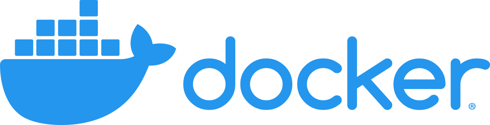

<a href="https://chronoslany.com/">
    
</a>


#
[](https://github.com/open-source-labs/Chronos)


# Chronos 

### :star: Star us on GitHub — it helps! :star:

Chronos is a comprehensive developer tool that monitors the health and web traffic of servers, microservices, and containers. Install the Chronos NPM package in your application to see real-time data monitoring and receive automated notifications over Slack or email.

## Table of Contents

- [Features](#features)
- [Branches](#branches)
    - [Master](#master)
    - [Middleware](#middleware)
    - [Microservices](#microservices)
    - [Docker](#docker)
    - [ChronosWebsite](#chronoswebsite)
    - [Others](#others)
- [Installation](#installation)
    - [1. Pre-Installation](#1.-pre-installation)
    - [2. Install Dependencies](#2.-install-dependencies)
    - [3. Configure Chronos](#3.-configure-chronos)
    - [4. Initialize Chronos](#4.-initialize-chronos)
- [Configuration](#configuration)
- [Notifications](#notifications)
- [License](#license)
- [Links](#links)
<br>

## Features 

- Distributed tracing enabled across microservices applications
- Supports  and  protocols
- Compatible with 
- Provides  container stats (e.g. ID, memory usage %, CPU usage %, running processes, etc.)
- Supports  and  databases
- Displays real-time temperature, speed, latency, and memory statistics
<br>

###### Return to [Top](#Chronos)
<br>

## Demo


###### Return to [Top](#Chronos)
<br>


## Branches

### Master

The **'master'** branch of this repository is where the Electron application for Chronos is deployed. The Chronos monitoring tool's _default configuration_ includes two databases: one PostgresQL and one MongoDB, that are both connected and configured for you in the dashboard so you can easily view the metrics and graphs available to you. 

**NOTE:** To _replace_ or _override_ these two default databases that we provide, change the database URIs stored in the following path: 
```
root directory -> electron -> user -> settings.json
```
<br>

### Middleware

The **'middleware'** branch is what is ultimately deployed to the NPM package, which is what you will install and configure in your own application in order to use Chronos.
<br>

### Microservices

The **'dummy-microservices'** branch is where we provide a sample microservices application to test out Chronos and to apply all the powerful, built-in features of Chronos as a monitoring tool on an existing application for your testing convenience. 
<br>

### Docker

The **'docker/microservice'** branch is where we provide a sample _dockerized_ microservices application to test out Chronos and to apply distributed tracing across different containers for your testing convenience.. 

 Give your containers the same names you use for arguments for microservice names. Read more about it under the INSTALLATION section below.

 In order to have container stats saved to your database along with other health info, when starting up the containers, bind volumes to this path:
```
/var/run/docker.sock
```

For example, you can type the following when starting up a container:
```
docker run -v /var/run/docker.sock:/var/run/docker.sock [your-image-tag]
```

If you're using docker-compose to start up multiple containers at once, you can add a `volumes` key for each of your services in the YAML file:

```
volumes:
  - "/var/run/docker.sock:/var/run/docker.sock"
```

\*Note: This module leverages the features of [systeminformation](https://systeminformation.io/).

<br>

### ChronosWebsite

The **'chronosWebsite'** branch is where the source code for the website, chronoslany.com, exists. The website currently has a working download link for Chronos as a desktop application for **MacOS**, and the Windows and Linux download links will redirect you to the Apple Store to buy a Macbook Pro.
<br>

### Others

Please feel free to ignore the other branches in the repository ('Demo', 'Dev')

###### Return to [Top](#Chronos)
<br>


## Installation
This is for the latest Chronos verion **5.1 release and later**.

- Stable release: 5.1.0
- LTS release: 5.0.1

### 1. Pre-Installation

Make sure you're running version 12.18.3 of , which is the most recent LTS (long-term support) version. 

If you need to roll back from  14.9.0, make sure to run 
```npm rebuild```
in the root directory.

If you're installing Chronos into a microservices application, and you have different folders for each microservice, make sure you also run 
```npm rebuild```
in each microservices folder **after you roll back to version 12.18.3.**
<br>

### 2. Install Dependencies

To use Chronos in your existing application, download and install the following in the root directory:
```
npm install chronos-tracker
```
<br>

### 3. Configure Chronos

After you've installed `chronos-tracker` in the root directory of your application, add a `chronos-config.js` file in the root directory. If your application has 

```js
// A sample `chronos-config.js` file

const chronos = require('chronos-tracker');

chronos.use({
  microservice: 'payments',
  interval: 2000,
  dockerized: true,
  database: {
    type: 'MongoDB',
    URI: process.env.MONGO_URI,
  },
  notifications: [],
});
```

**More information on configuring Chronos and setting up notifications below**
<br>

### 4. Initialize chronos

```js
const cmd = require('chronos-tracker');
require('./cmd-config'); // Bring in config file

cmd.propagate();
app.use('/', cmd.track());
```

**Download Chronos** to start monitoring your application data [here]()
<!-- # Installation

Chronos consists of a [Node](https://nodejs.org/en/) module available through the
[npm registry](https://www.npmjs.com/) and a lightweight [Electron](https://electronjs.org/) desktop application. -->

###### Return to [Top](#Chronos)
<br>

## Configuration

The `microservice` property takes in a string. This should be the name of your server or microservice. For **Docker** containers, the name of the microservice should be the same as the name of the corresponding Docker container.

The `interval` property is optional and takes in an integer. This controls the Chronos monitoring frequency. If this is omitted, Chronos will defualt to recording server health every 2000 ms or 2 seconds.

The `dockerized` property is optional and should be specified as `true` if the server is running inside of a Docker container. Otherwise, this should be `false`. If omitted, Chronos will assume this server is not running in a container.

The `database` property is required and takes in the following:
- `type` which should be a string and only supports 'MongoDB' and 'PostgreSQL'.
- `URI` which should be a connection string the database you intend Chronos to write and record data regarding health, HTTP route tracing, and container infomation to. A `.env` is recommended.

- [6] isDockerized: Is this microservice running in a Docker container? Enter "yes" or "no". (Defaults to "no".)
  - IMPORTANT: When starting up the container, give it the same name that you used for the microservice, because the middleware finds the correct container ID of your container by matching the container name to the microservice name you input as 1st argument.
  - Don't forget to bind mount to Docker socket. See NEW FEATURE section above.

###### Return to [Top](#Chronos)
<br>


## Notifications

The `notifications` property is optional and allows developers to be alerted when the server responds to requests with status codes >= 400. To set up notifications, set the value of the `notifications` property to an array of objects, each with a `type` and `settings` property. 

Chronos only supports **Slack** and **email** notifications.
<br>

### Slack

Chronos uses the **Slack API** to send messages to a Slack channel and only requires the **webhook url**. Learn how to set up [Slack webhooks](https://api.slack.com/messaging/webhooks) for your team.

An example of configured **slack** settings:

```js
// ...
notifications: [
  {
    type: 'email',
    settings: {
      slackurl: process.env.WEBHOOK
    }
  }
]
// ...
```
<br>

### Email

Chronos provides the option to send emails. The properties that should be provided are the following
- `emails` - The recipient list (string) can be a single email address or multiple as comma seprated values. 
- `emailHost` - The smtp host (string) of your email server
- `emailPort` - The email port (integer) is either **465** or **587** depending on the sender email security settings. Learn more about email ports at the [nodemailer docs](https://nodemailer.com/smtp/)
- `user` - The email address (string) of the sender
- `password` - The password (string) of the sender email

_NOTE: Email notification settings may require alternative security settings to work_
 
An example of configured **email** settings:

```js
// ...
notifications: [
  {
    type: 'email',
    settings: {
      emails: 'foobar@email.com, bizbaz@email.edu',
      emailHost: 'smpt@gmail.com',
      emailPort: 465,
      user: process.env.SENDER_EMAIL,
      password: process.env.SENDER_PASSWORD
    }
  }
]
// ...
```
###### Return to [Top](#Chronos)
<br>


## Microservice Test Suite

Additionally, the repo includes a test suite of microservices utilizing the Chronos node module so that their communication, health, and container data can be logged. You can then visualize the data with the Electron app.

The microservices include individual Dockerfiles in their respective directories. A docker-compose.yml is in the root directory in case you'd like to deploy all services together.

Refer to the [README](https://github.com/oslabs-beta/Chronos/tree/docker/microservice) of that branch for more details.
<hr>

###### Return to [Top](#Chronos)
<br>


## Electron desktop application

After installing the node module in each microservice, download the Electron desktop application from the public [Chronos]() repo.

Inside the downloaded directory, install all dependencies using the `npm install` command followed by the `npm start` command to start the Electron desktop application.
<hr>

###### Return to [Top](#Chronos)
<br>


## Contributing

Development of Chronos is open source on GitHub through the tech accelerator umbrella OS Labs, and we are grateful to the community for contributing bugfixes and improvements. Read below to learn how you can take part in improving Chronos.

- [Contributing](https://github.com/oslabs-beta/Chronos/blob/master/CONTRIBUTING.md)
<hr>

###### Return to [Top](#Chronos)
<br>


## License

Chronos is [MIT licensed.](https://github.com/oslabs-beta/Chronos/blob/master/LICENSE.md) 
<hr>

###### Return to [Top](#Chronos)
