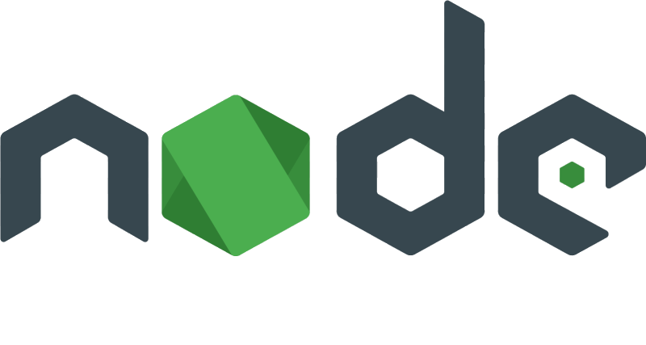

<a href="https://chronoslany.com/">
    
</a>


#
[](https://github.com/open-source-labs/Chronos)


# Chronos 

### :star: Star us on GitHub — it helps! :star:

Chronos is a comprehensive developer tool that monitors the health and web traffic of servers, microservices, and containers. Install the Chronos NPM package in your application to see real-time data monitoring and receive automated notifications over Slack or email.

## Table of Contents

- [Features](#features)
- [Demo](#demo)
- [Installation](#installation)
    1. [Pre-Installation](#1.-pre-installation)
    2. [Install Dependencies](#2.-install-dependencies)
    3. [Configure Chronos](#3.-configure-chronos)
    4. [Initialize Chronos](#4.-initialize-chronos)
    5. [Docker Configuration](#5.-docker-configuration)
- [Notifications](#notifications)
    - [Slack](#slack)
    - [Email](#email)
- [Branches](#branches)
    1. [Master](#1.-master-branch)
        <br>[Examples](#examples)
    2. [Middleware](#2.-middleware-branch)
- [Technologies](#technologies)
- [License](#license)

#
###### Return to [Top](#Chronos)
<br>

## Features 

- Distributed tracing enabled across microservices applications
- Supports  and  protocols
- Compatible with 
- Provides  container stats (e.g. ID, memory usage %, CPU usage %, running processes, etc.)
- Supports  and  databases
- Displays real-time temperature, speed, latency, and memory statistics
#
###### Return to [Top](#Chronos)
<br>

## Demo

Add text here<br>
Add text here<br>
Add text here<br>
Add text here<br>
Add text here<br>


#
###### Return to [Top](#Chronos)
<br>

## Installation
This is for the latest Chronos version **5.1 release and later**.

- Stable release: 5.1.0
- LTS release: 5.0.1

### 1. Pre-Installation
Make sure you're running version 12.18.3 of , which is the most recent LTS (long-term support) version. 

If you need to roll back from  14.9.0, make sure to run 
```npm rebuild```
in the root directory.

If you're installing Chronos into a microservices application, and you have different folders for each microservice, make sure you also run 
```npm rebuild```
in each microservices folder **after you roll back to version 12.18.3.**
<br>
<br>

### 2. Install Dependencies

To use Chronos in your existing application, download and install the following in the **root directory** of _each of your microservice applications_:
```
npm install chronos-tracker
```

### 3. Configure Chronos

Similarly, in the **root directory** of _each of your microservice applications_, create a `chronos-config.js` file with properties listed below:

```js
// A sample `chronos-config.js` file

const chronos = require('chronos-tracker');

chronos.use({
  microservice: 'payments',
  interval: 2000,
  dockerized: true,
  database: {
    type: 'MongoDB',
    URI: process.env.MONGO_URI,
  },
  notifications: [],
});
```

The `microservice` property takes in a string. This should be the name of your server or microservice. For **Docker** containers, the name of the microservice should be the same as the name of the corresponding Docker container.

The `interval` property is optional and takes in an integer. This controls the Chronos monitoring frequency. If this is omitted, Chronos will defualt to recording server health every 2000 ms or 2 seconds.

The `dockerized` property is optional and should be specified as `true` if the server is running inside of a Docker container. Otherwise, this should be `false`. If omitted, Chronos will assume this server is not running in a container.

The `database` property is required and takes in the following:
- `type` which should be a string and only supports 'MongoDB' and 'PostgreSQL'.
- `URI` which should be a connection string the database you intend Chronos to write and record data regarding health, HTTP route tracing, and container infomation to. A `.env` is recommended.

<!-- - `isDockerized`: Is this microservice running in a Docker container? Enter `yes` or `no`. The current default setting is `no`.
  -  When starting up the container, give it the same name that you used for the microservice, because the middleware finds the correct container ID of your container by matching the container name to the microservice name you input as 1st argument.
  -  Don't forget to bind mount to Docker socket. -->

The `notifications` property is optional. Jump to the section below, [Notifications](#notifications) to configure  or email  notifications.
<br>
<br>

### 4. Initialize Chronos

Wherever you create an instance of your server (see example below),

```js
// Example 
const express = require('express');
const app = express());
```

you will also need to require in `chronos-tracker` and initialize Chronos, as well as the `./chronos-config` file. You will then need to invoke `chronos.propagate()` to initiate the route tracing, in addition to implementing `chronos.track()` for all endpoints.

```js
const chronos = require('chronos-tracker');
require('./chronos-config'); // Bring in config file

// ...

chronos.propagate();
app.use('/', chronos.track());
```

You should be good to go! The last step, Step #5, is **only applicable** if you need to configure  for your application. 

### 5. Docker Configuration

Again, this step is **only applicable** if you are currently using  containers for your microservices. 

 Give your containers the same names you pass as arguments for microservice names.

 In order to have container stats saved to your database, along with other health info, bind volumes to this path when starting up the containers:
```
/var/run/docker.sock
```

For example, you can type the following when starting up a container:
```
docker run -v /var/run/docker.sock:/var/run/docker.sock [your-image-tag]
```

If you're using `docker-compose` to start up multiple containers, you can add a `volumes` key for each of your services in the `docker-compose.yml` file:

```
volumes:
  - "/var/run/docker.sock:/var/run/docker.sock"
```
#
###### Return to [Top](#Chronos)
<br>

## Notifications

The `notifications` property is optional and allows developers to be alerted when the server responds to requests with status codes >= 400. To set up notifications, set the value of the `notifications` property to an array of objects, each with a `type` and `settings` property. 

Chronos only supports **Slack** and **email** notifications.
<br>

### Slack

Chronos uses the  API to send messages to a Slack channel and only requires the **webhook url**. Learn how to set up [Slack webhooks](https://api.slack.com/messaging/webhooks) for your team.

An example of configured **slack** settings:

```js
// ...
notifications: [
  {
    type: 'email',
    settings: {
      slackurl: process.env.WEBHOOK
    }
  }
]
// ...
```

### Email
Chronos provides the option to send  emails. The properties that should be provided are the following
- `emails` - The recipient list (string) can be a single email address or multiple as comma seprated values. 
- `emailHost` - The smtp host (string) of your email server
- `emailPort` - The email port (integer) is either **465** or **587** depending on the sender email security settings. Learn more about email ports at the [nodemailer docs](https://nodemailer.com/smtp/)
- `user` - The email address (string) of the sender
- `password` - The password (string) of the sender email

_NOTE: Email notification settings may require alternative security settings to work_
 
An example of configured **email** settings:

```js
// ...
notifications: [
  {
    type: 'email',
    settings: {
      emails: 'foobar@email.com, bizbaz@email.edu',
      emailHost: 'smpt@gmail.com',
      emailPort: 465,
      user: process.env.SENDER_EMAIL,
      password: process.env.SENDER_PASSWORD
    }
  }
]
// ...
```
#
###### Return to [Top](#Chronos)
<br>

## Branches

### 1. Master Branch
#

The **'master'** branch of this repository is where the  application for Chronos is deployed. The Chronos monitoring tool includes two database examples, one PostgresQL and one MongoDB, with sample data sets.

**NOTE:** To _replace_ or _delete_ these two databases, simply change the database URIs stored in the following path: 
```
root directory -> electron -> user -> settings.json
```

### Examples
#

We provide two working example microservice applications in the `master` branch for you to test out Chronos: `microservices` and `docker`.

#### Microservices
#

In the `microservices` folder, we provide a sample microservice application that successfully utilizes Chronos to apply all the powerful, built-in features of our  monitoring tool. You can then visualize the data with the  app.

#### Docker
#

In the  folder within the `master` branch, we provide a sample _dockerized_ microservices application to test out Chronos and to apply distributed tracing across different containers for your testing convenience.

The `docker` folder includes individual  files in their respective directories. A docker-compose.yml is in the root directory in case you'd like to deploy all services together.

Refer to the [README](link) in the `docker` folder for more details.

<br>

### 2. Middleware Branch
#
The **'middleware'** branch is the current codebase for the  package, which is what you will install in your own application in order to use Chronos.
<br>

#
###### Return to [Top](#Chronos)
<br>

## Technologies

- 
- 
- 
- 
- 
- 
- 
- 
- 
-  
- 
- 
- 
- 
- 
- 
- 
- 
- 
- 
 
#
###### Return to [Top](#Chronos)
<br>


## Contributing

Development of Chronos is open source on GitHub through the tech accelerator umbrella OS Labs, and we are grateful to the community for contributing bugfixes and improvements. Read below to learn how you can take part in improving Chronos.

- [Contributing](https://github.com/oslabs-beta/Chronos/blob/master/CONTRIBUTING.md)
#
###### Return to [Top](#Chronos)
<br>


## License

Chronos is  [licensed.](https://github.com/oslabs-beta/Chronos/blob/master/LICENSE.md) 
#
###### Return to [Top](#Chronos)
