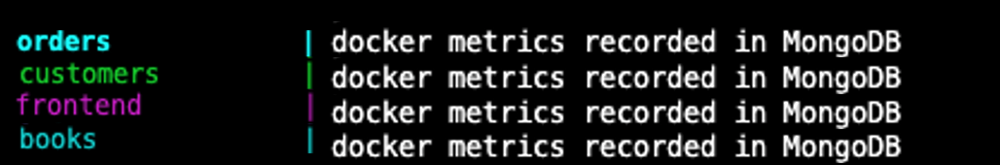
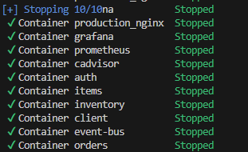
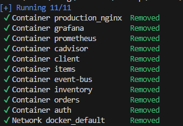

# Chronos Dockerized Microservices Example

This sample microservices architecture allows developers to explore the functionality of Chronos but with one docker compose command. This consists of four microservices, which are contained within the directories:

- books
- customers
- frontend
- orders

Each microservice has its own server, which receives requests from both the client and from other microservices.

- _books_, _customers_, and _orders_ also have their own databases, which they can query to respond to those requests.

The frontend has a reverse proxy set up for proxying requests to the appropriate service (individual application) in the microservice network.

In development they're all run separately on different ports, with said ports listening out for requests. This is for demonstration and testing purposes.

Ideally, in a production environment, all the services will be up and running concurrently from the get go and that's what the `docker-compose.yml` file helps us achieve. It is able to chain all the services and run them together with one command.

Docker also ensures that the versions that worked well on dev are bundled up and distributed and used to run the containers for the individual containers.

## Additional Documentation

For additional details on how Chronos works this example, please review the Docker section in the [Chronos NPM Package README](../../chronos_npm_package/README.md).

## Steps to Run Example

Peform the following steps in each of the _books_, _customers_, _frontend_, and _orders_ directories

1. Add a `.env` file to _each_ folder with the following key/value pairs:

- **NOTE**: Ensure that there are no quotes surrounding any of the keys and values.

> > > New collaboration group - testing all 5 url added to each .env// --> testing now...<<<

```
CHRONOS_DB = MongoDB or PostgreSQL
CHRONOS_URI = The URI to the desired MongoDB or PostgreSQL database to save health metrics via Chronos
BOOK_URI = A MongoDB URI for the bookserver microservice to use
CUSTOMER_URI = A MongoDB URI for the customerserver microservice to use
ORDER_URI = A MongoDB URI for the orderserver microservice to use
```

2.  Verify that `@chronosmicro/tracker` is a dependency in each of the _books_, _customers_, _frontend_, and _orders_ folders (see the `package.json` in each folder).

    - If the @chronosmicro/tracker dependency is listed as a **remote** npm package (i.e. `"@chronosmicro/tracker": "^11.0.1"`) and you've ran `npm install`, no further work is needed continue to step 3.

    - If you have the dependency as
      `"@chronosmicro/tracker": "file:./chronos_npm_package"`, which is a **local** file, make sure to change the version from `"file:./chronos_npm_package"` to `"^11.0.1"` and run npm install.

3.  With the terminal navigated to the the _examples/docker_ folder, run the command:

> > > No working, installing VSC docker ext<<< --must have docker installed for this command to run

```
docker-compose -f docker-compose.yml up
```

4. If you run into any issues regarding 'linux/amd64,linux/arm/v7,linux/arm64/v8' for cadvisor, navigate to the docker-compose.yml and find the cadvisor dictionary. Change "platform" to linux/arm64/v8 for M1 Chips and linux/amd64 for Intel Chips.

If you run into any issues regarding versions/images cadvisor, navigate to the docker-compose.yml and find the cadvisor dictionary. Change "image" to `image: gcr.io/cadvisor/cadvisor:latest` to `image: gcr.io/cadvisor/cadvisor:v0.47.0`

###

You should now see the containers running in your terminal, each reporting `"Docker data recorded in..."`.

<p align="center">
  
</p>

If this is being displayed for the books, customers, frontend, and orders microservices then the example is successfully saving health metrics to your database of choice!

If there is any error when running the applications and the underlying files for a microservice were changed, be sure to delete the previous image before calling `docker-compose -f docker-compose.yml up` again.

- If you do not, the above docker compose command will not know to rebuild the image and the code changes meant to fix any issues will not be rolled into the existing Docker image!

Your microservice health metrics can now be viewed at the given `CHRONOS_URI` or, preferrably, in the Electron.js desktop application.

## To stop and remove containers

To stop containers, use `^C`.

<p align="center">
  
</p>

Use `docker compose down` to remove.

<p align="center">
  
</p>

## Contributing

Chronos hopes to inspire an active community of both users and developers. For questions, comments, or contributions, please submit a pull request.

Read our [contributing README](../../CONTRIBUTING.md) to further learn how you can take part in improving Chronos.

## License

[MIT](https://github.com/oslabs-beta/Chronos/blob/master/LICENSE.md)
