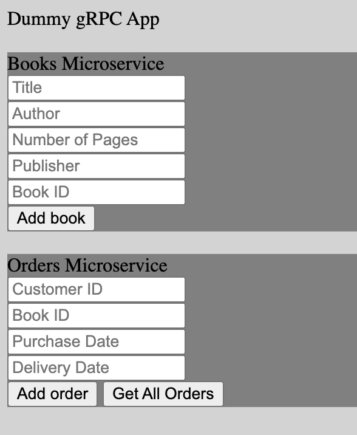

## Microservices Architecture
Microservices architecture for testing [Chronos](https://github.com/open-source-labs/Chronos), a microservice communication and health visualizer.

## Purpose and Design
This sample microservices architecture allows developers to explore the functionality of Chronos with gRPC calls. It consists of 3 microservices, which are contained within the directories:
- Reverse Proxy
- Books
- Orders

Each microservice has its own server, which receives requests from both the client and from other microservices. Books, Customers, and Orders also have their own databases, which they can query to respond to those requests.

## Getting Started w/ gRPC Example Microservices 

Follow **'main'** branch [README](../../README.md) steps: Pre-Installation, Install Dependencies before start. 

We have already initialized Chronos within this example. To track gRPCs within your own application, please review the [README for the Chronos microtracker npm package](../../chronos_npm_package/README.md) for more information.

On **each** microservice in ```example/microservices```, perform the following steps:
  - Create a .env file under the microservice's folder and input your own Mongodb Atlas URI for Microservice_URI, CHRONOS_URI and ORDER_URI (example below):

```
BOOK_URI = mongodb+srv://<username>:<password>@cluster0.o2hx5.mongodb.net/<dbname>?retryWrites=true&w=majority

CHRONOS_URI = mongodb+srv://<username>:<password>@cluster0.o2hx5.mongodb.net/<dbname>?retryWrites=true&w=majority

ORDER_URI = mongodb+srv://<username>:<password>@cluster0.o2hx5.mongodb.net/<dbname>?retryWrites=true&w=majority
```

  - In each Microservices *chronos-config.js* file, verify that `"mode"` property has a value of `"microservices"`

  - Inside each microservice directory, install all dependencies using the `npm install`
  - Run `npm run start` in each folder directory
  - Head over to localhost:3000 to view reverse proxy acting as the front end of this microservice example

<p align="center">
  
</p>

  - Start adding data!
  - Run `npm run dev:app` and `npm run dev:electron` **in separate terminals** to start Electron app
    - Add a new application in Chronos app dashboard.
    - The URI should be your CHRONOS_URI


**To test the functionality of Chronos using this sample microservices architecture, you must have the [Chronos microservice tracker](https://www.npmjs.com/package/@chronosmicro/tracker) within each microservice.**

 This is already included as a dependency, therefore there should be no need to install it manually. But if it is missing from the dependency list, the installation instructions for both the Chronos node module and the Chronos desktop visualizer are below:

#### Electron desktop application

After installing the node module in each microservice, download the Electron desktop application from the public [Chronos](https://github.com/oslabs-beta/Chronos) repo.

Inside the downloaded directory, install all dependencies using the `npm install` command, followed by the `npm run both` command to start the Electron desktop application.

## Contributing

Chronos hopes to inspire an active community of both users and developers. For questions, comments, or contributions, please submit a pull request.

## License

  [MIT](LICENSE)

[npm-image]: https://img.shields.io/npm/v/chronos-microservice-debugger3.svg
[npm-url]: https://www.npmjs.com/package/chronos-microservice-debugger3
[downloads-image]: https://img.shields.io/npm/dm/chronos-microservice-debugger3.svg
[downloads-url]: https://npmjs.org/package/chronos-microservice-debugger3
 