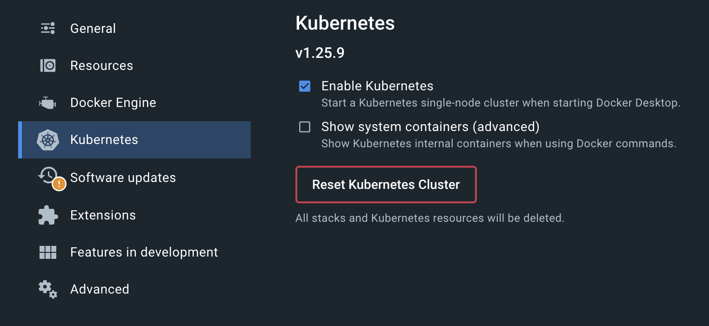
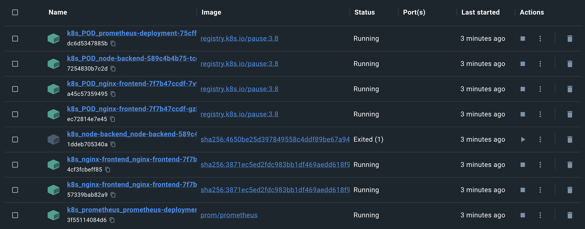
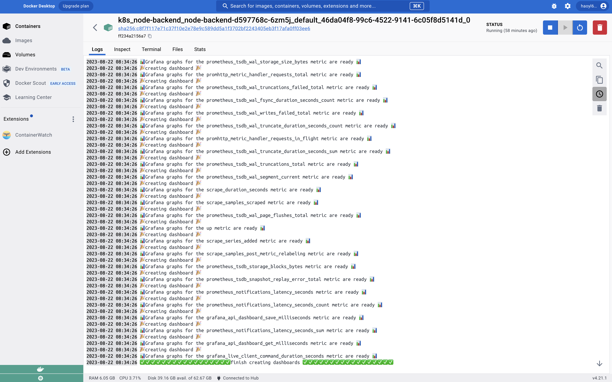

# Chronos Kubernetes Example

This example demonstrates how **Chronos** can be used to track health metrics of a Kubernetes cluster when deployed with a Prometheus monitoring server. The folders in this example include the following:

- _client_: A React application (in the _client_ folder) that requests a random number from a Node/Express API
- _server_: The Node/Express API that responds with the random number. This is where the **Chronos** package is actually imported and executed.
- _launch_: YAML files describing the _deployment_ and _service_ configurations for the client, server, and Prometheus server
- _scripts_: Scripts to automate some of the steps involved in running the example

## Additional Documentation

For additional information on how Chronos works this example, please review the Kubernetes section in the [Chronos NPM Package README](../../chronos_npm_package/README.md).

## Install Docker Desktop

This example has been developed and tested using the Kubernetes Engine packaged in the Docker Desktop application.

1. Follow instructions online to download/install Docker Desktop and to **enable the Kubernetes Engine**.

<p align="center">
  
</p>

## Setup Prometheus and Grafana

1. `cd` into the _scripts_ folder and run the setup script with `./setup.sh` - the process of configuring Prometheus and Grafana.

**Note**: If you run into `Permission denied` error, try run this command: `chmod +x [the_file_name]` in the terminal and re-run `./setup.sh`.

2. Open your web browser and navigate to `localhost:32000`. If you've correctly completed step 1 of the setup, you'll be directed to the Grafana login page. Use `admin` for both the username and password to log in. You can update the password after logging in if needed.

3. Navigate to `Home -> Administration -> Service accounts`, then click `Add service account` to create an service account. Be sure to choose `Admin` as the role. Then click `Add service account token`, hit `generate`, you are done! Remember this token, you will be using this token to access Grafana HTTP API programmatically.

4. Add a `.env` file to the _server_ folder that contains the following key/value pairs:

```
CHRONOS_GRAFANA_API_KEY = Bearer [the access token you created in step 3]
```

## Build the Client

1. `cd` into the _client_ folder and run the following command:

```
docker build -t frontend:1.0 .
```

**Mac Users:** Alternative to running the above command, `cd` into the scripts folder and run the `buildClient.sh` script by running `./buildClient.sh` in the terminal.

## Build the Server

1. In the `.env` file you just created, add the following key/value pairs as well:

```
CHRONOS_DB = MongoDB or PostgreSQL
CHRONOS_URI = The URI to the desired MongoDB or PostgreSQL database to save health metrics via Chronos
```

2. Then look at the `package.json` file in the server folder and **note how `@chronosmicro/tracker` is included as a dependency:**

- If the @chronosmicro/tracker dependency is listed as a **remote npm package** (i.e. `"@chronosmicro/tracker": "^12.0.1"`), no further work is needed.

- If the @chronosmicro/tracker dependency is listed as a **local npm package** (i.e. `"@chronosmicro/tracker": "file:./chronos_npm_package"`), the Docker build will require that the Chronos code is in this folder. Either:
  - Copy the _chronos_npm_package_ folder in manually, and **go to step 3**
  - **OR**
  - If you are a Mac user, you can use the `buildServer.sh` script to automate this process and **skip step 3**
    - Do this by `cd`ing into the _scripts_ folder and run the buildServer script with `./buildServer.sh` - the process of copying in the _chronos_npm_package_ folder, performing the Docker build, and then removing the copied in folder is automated.

3. (skip if you used the `buildServer.sh` script)

`cd` into the _server_ folder and run the following command:

```
docker build -t backend:1.0 .
```

## Start the npm Server

1. `cd` into the `server` folder inside `chronos_npm_package`, then run `npm install` to install all dependencies.

2. run `npm start` to start npm server.

3. You should see `🤖 Example app listening on port 1111! chronos_npm_package Server Loaded 🎉` in the terminal.

## Deploy the Cluster

1. `cd` into the launch folder and run the following commands to start the services and deployments described in the YAML files:

```
kubectl apply -f backend.yml
kubectl apply -f frontend.yml
```

**Mac Users:** Alternative to running the above commands, `cd` into the _scripts_ folder and run the `startKuber.sh` script.

2. Check in Docker desktop if your containers have been created. You should see something similar to the following:

<p align="center">
  
</p>
<p align="center">
  
</p>

The second image is inside **k8s_node-backend_node-backend-d597768c-6zm5j_default_46da04f8-99c6-4522-9141-6c05f8d5141d_0** container, it may take a while to show up in Docker desktop based on the scraping interval.

Your microservice health metrics can now be viewed at the given `CHRONOS_URI` or, preferrably, in the Electron.js desktop application.

## Teardown the Cluster

1. `cd` into the launch folder and run the following commands to stop the running services and deployments:

```
kubectl delete -f clusterRole.yml
kubectl delete -f promConfig.yml
kubectl delete -f prometheus.yml
kubectl delete -f backend.yml
kubectl delete -f frontend.yml
```

**Mac Users:** Alternative to running the above commands, `cd` into the _scripts_ folder and run the `stopKuber.sh` script

**Note**: The above part only teardown Prometheus and Kubernetes, it leaves Grafana running. This is because if you teardown Grafana, the next time you redeploy you will be login with a new account, the access token and dashboard you created within this account will be lost.

To teardown grafana, run the following commands:

```
kubectl delete -f launch/grafana-datasource-config.yml
kubectl delete -f launch/grafanaService.yml
kubectl delete -f launch/grafana.yml
```

## Insight for how to migrate this example to your own app

To configure Prometheus and Grafana, you can simply copy the below yaml files to your own app.

```
clusterRole.yml
promConfig.yml
prometheus.yml
grafana-datasource-config.yml
grafanaService.yml
grafana.yml
```

Then configure Prometheus and Grafana with your own application's deployments using images.

## Contributing

Chronos hopes to inspire an active community of both users and developers. For questions, comments, or contributions, please submit a pull request.

Read our [contributing README](../../CONTRIBUTING.md) to further learn how you can take part in improving Chronos.

## License

[MIT](https://github.com/oslabs-beta/Chronos/blob/master/LICENSE.md)
