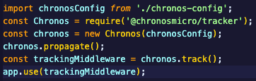
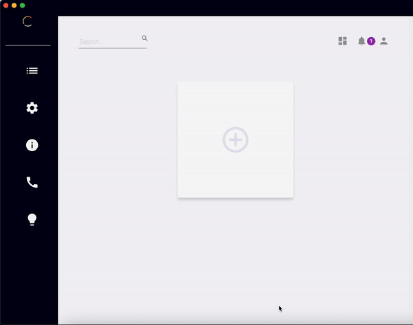

# Example Microservices Application (Non-Containerized)

## Purpose

An example microservices application for testing the [Chronos App](https://github.com/open-source-labs/Chronos). The [Chronos NPM package](https://www.npmjs.com/package/@chronosmicro/tracker) is installed and configured in each service to track metrics on communcation between services such as request and response cycles. Below are instructions for demo-ing Chronos functionality.

## Design

The microservices application consists of six microservices, which are located within the following directories:

- client
- auth
- items
- inventory
- orders
- event-bus

The client serves a build version of the React application found in client-dev.

The application functionality includes:

- login/logout with a predefined test user
- creating items
- adjustment of item inventories
- creating orders
- throwing an intentional 404 error - sending a request to a non-existent route

The Chronos NPM package is configured to track these request / response cycles.

Chronos is instantiated and its tracking functionality enabled by the following code block, found in each service's app.ts file.

\

The Event Bus serves as the intermediary between the backend services, facilitating communication between them. It receives and emits events whenever a resource is created.

The common folder maintains code snippets used across each microservice, and is distributed by way of a common NPM package.

## Database and .env setup

A `Makefile` file, located in the `examples/microservices` folder, has been provided with the necessary environmental variables to spin-up the application.

This file used the community version of  `MongoDB`, make sure it's connected before running `npm run start:microservices`.
It can be replaced by any Mongo_URI.

Example:
- `CHRONOS_DB`: `MongoDB` or `PostgreSQL`
- `CHRONOS_URI`: The URI to the desired MongoDB or PostgreSQL database where the **Chronos NPM Package** will store recorded metrics. The **Chronos desktop application** retrieves and displays metrics from this database
- `MONGO_URI_AUTH`: A **MongoDB** URI for the `auth` microservice to use
- `MONGO_URI_ITEMS`: A **MongoDB** URI for the `items` microservice to use
- `MONGO_URI_INVENTORY`: A **MongoDB** URI for the `inventory` microservice to use
- `MONGO_URI_ORDERS`: A **MongoDB** URI for the `orders` microservice to use
- `JWT_KEY`: A random string used to sign and verify JSON Web Tokens used by the auth service - the random string provided in **sample.env** will work
- `JWT_LIFETIME`: The time-to-expiration of the JSON Web Token used by the auth service - this is set to `1d` in `sample.env` meaning user authentication is valid for 1 day

Note: You may run out of space in your database if the services run for an extended period of time. You can temporarily solve this by manually deleting the collection from the database regularly using a UI such as MongoDB Compass.

## Start the example

To spin up the example application:

1. Run `npm run start:microservices`
2. Click on the Example Button
3. Click on the Microservices card

\

Open a web browser to `localhost:5001` to send requests from the client

Your microservice health metrics may be viewed in the given `CHRONOS_URI` database, or in the Electron.js desktop application.

## Notes

Plotly utilizes WebGL to render graphs, but WebGL can support only 8-16 layers simultaneously. Therefore, it is recommended to selectively choose a limited number of layers for optimal performance.

## Additional Documentation

For additional information on how Chronos works this example, please review the microservices section in the [Chronos NPM Package README](../../chronos_npm_package/README.md).

## Contributing

Chronos hopes to inspire an active community of both users and developers. For questions, comments, or contributions, please submit a pull request.

Read our [contributing README](../../CONTRIBUTING.md) to further learn how you can take part in improving Chronos.

## License

[MIT](https://github.com/oslabs-beta/Chronos/blob/master/LICENSE.md)
